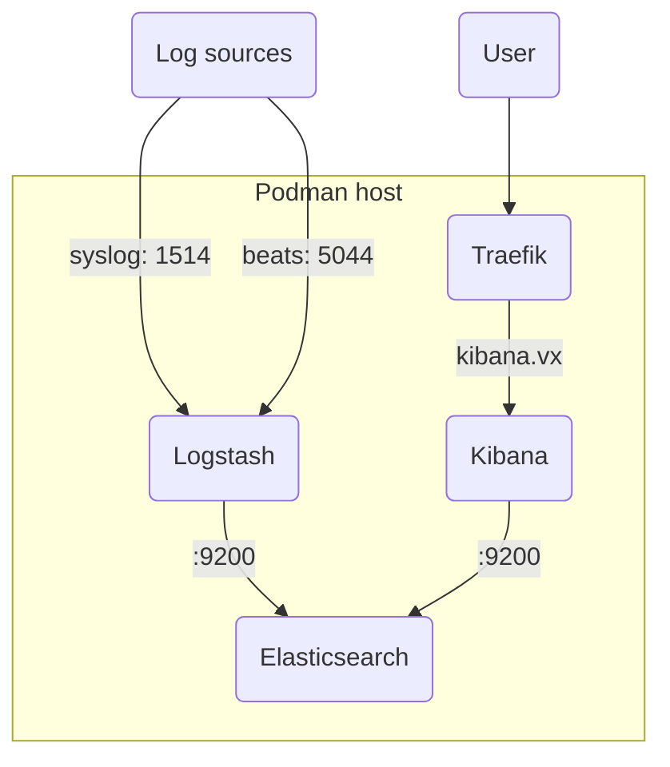
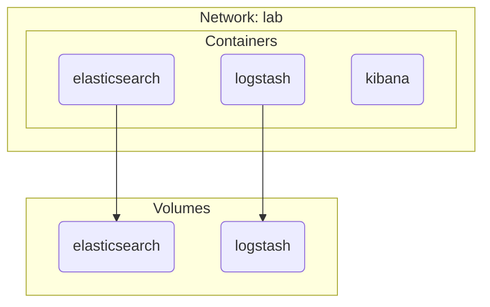
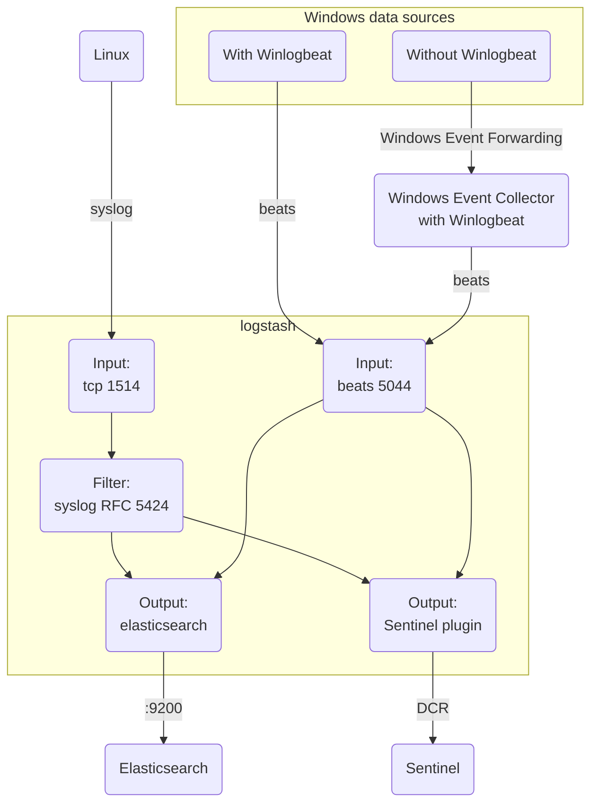

## 1. Components

### 1.1. Lab routing



### 1.2. Quadlets



### 1.3. Logs flow



## 2. Setup Elastic stack

> [!Warning]
>
> Elastic stack setup with xpack security disabled; i.e. TLS and RBAC (and other security features) are disabled

Download the quadlet unit files and reload systemd:

```sh
for item in elasticsearch.container elasticsearch.volume logstash.container logstash.volume logstash.volume kibana.container; do
  curl -sL --output-dir /etc/containers/systemd/ -O https://github.com/joetanx/setup/raw/refs/heads/main/elastic/quadlets/$item
done
systemctl daemon-reload
```

Pull container image (optional) and start service:

```sh
podman pull docker.io/elastic/elasticsearch:9.2.3
podman pull docker.io/elastic/logstash:9.2.3
podman pull docker.io/elastic/kibana:9.2.3
systemctl start kibana logstash
```

> [!Tip]
>
> The `kibana` and `logstash` systemd unit files are configured with `elasticsearch`
>
> Starting either `kibana` or `logstash` will automatically start elasticsearch

### 2.1. Logstash setup

> [!Warning]
>
> The first run of `logstash` (in preceding section) must have `lsdata` **empty** for the directory with necessary Logstash folder structure, files and binaries to intialize
>
> If the `lsdata` is not empty on the first run, logstash skips initialization and may fail to start
>
> Only create the config and pipeline files after the first run is complete

Download the sample [logstash.conf](/elastic/logstash.conf) into `lsdata\pipelines`:

```sh
curl -sL --output-dir /var/lib/containers/storage/volumes/lsdata/_data/pipeline/ -O https://github.com/joetanx/setup/raw/refs/heads/main/elastic/logstash.conf
```

Restart `logstash`:

```sh
systemctl restart logstash
```

## 3. Syslog events

The sample [logstash.conf](/elastic/logstash.conf) has grok pattern to [parse RFC 5424](https://rfc5424-logging-handler.readthedocs.io/en/latest/syslog_server.html) syslog format

https://github.com/joetanx/setup/blob/8a48cfe239c665606e76350c7ab162f8de639d5f/elastic/logstash.conf#L11-L15

### 3.1. Test syslog with logger

> [!Tip]
>
> logger sends in RFC 5424 by default, to debug as RFC 3164 or if using [logstash syslog input plugin](https://www.elastic.co/docs/reference/logstash/plugins/plugins-inputs-syslog), add `--rfc3164` option to logger

Test send syslog to logstash:

```sh
logger -n logstash.vx -P 1514 -T -i -p auth.info -t sshd --msgid 4321 'Failed password for invalid user doesnotexist from 98.76.54.32 port 54321 ssh2'
```

Go to Kibana → Analytics → Discover


See the event ingested into elasticsearch:


Example syslog elasticsearch entry:

```json
{
  "@timestamp": [
    "2026-01-05T13:19:46.453Z"
  ],
  "@version": [
    "1"
  ],
  "data_stream.dataset": [
    "syslog"
  ],
  "data_stream.namespace": [
    "default"
  ],
  "data_stream.type": [
    "logs"
  ],
  "host.ip": [
    "192.168.17.82"
  ],
  "host.name": [
    "services.vx"
  ],
  "log.syslog.facility.code": [
    4
  ],
  "log.syslog.facility.name": [
    "security/authorization"
  ],
  "log.syslog.facility.name.text": [
    "security/authorization"
  ],
  "log.syslog.severity.code": [
    6
  ],
  "log.syslog.severity.name": [
    "informational"
  ],
  "log.syslog.severity.name.text": [
    "informational"
  ],
  "process.id": [
    "52627"
  ],
  "process.name": [
    "sshd"
  ],
  "process.name.text": [
    "sshd"
  ],
  "sd.timeQuality.isSynced": [
    "1"
  ],
  "sd.timeQuality.syncAccuracy": [
    "510000"
  ],
  "sd.timeQuality.tzKnown": [
    "1"
  ],
  "syslog.message": [
    "Failed password for invalid user doesnotexist from 98.76.54.32 port 54321 ssh2"
  ],
  "_id": "AZuOUBnHQkFMSjVPs-Up",
  "_index": ".ds-logs-syslog-default-2026.01.05-000001",
  "_score": null
}
```

### 3.2. Configure rsyslog to send to logstash

> [!Tip]
>
> rsyslog sends in RFC 3164 by default, the `RSYSLOG_SyslogProtocol23Format` template sends in RFC 5424

Install rsyslog and setup rsyslog config file to send to logstash:

```sh
apt -y install rsyslog
cat << EOF >> /etc/rsyslog.d/50-default.conf
action(
    type="omfwd"
    target="logstash.vx"
    port="1514"
    protocol="tcp"
    template="RSYSLOG_SyslogProtocol23Format"
)
EOF
systemctl restart rsyslog
```

> [!Note]
>
> Forwarding rsyslog in Red Hat distributions is denied by SELinux
>
> Check if SELinux events if denied errors are seen on rsyslog:
>
> ```sh
> ausearch -m avc -ts recent | grep rsyslogd
> ```
>
> Allow syslog port on SELinux:
>
> ```sh
> yum -y install policycoreutils-python-utils
> semanage port -a -t syslogd_port_t -p tcp 1514
> ```

## 4. Windows event

### 4.1. Install winlogbeat

Download winlogbeat package, extract to `C:\Program Files\` and install as a service:

```pwsh
$file = 'winlogbeat-9.2.3-windows-x86_64'
$client = New-Object System.Net.WebClient
$client.DownloadFile("https://artifacts.elastic.co/downloads/beats/winlogbeat/$file.zip", "$file.zip")
Expand-Archive "$file.zip" -DestinationPath 'C:\Program Files\'
Rename-Item "C:\Program Files\$file" 'C:\Program Files\Winlogbeat'
Remove-Item "$file.zip"
powershell.exe -ExecutionPolicy Bypass -File 'C:\Program Files\Winlogbeat\install-service-winlogbeat.ps1'
```

Download example [winlogbeat.yml](/elastic/winlogbeat.yml) and start service:

> This example file collects common Windows security events and send to logstash at `logstash.vx`

```pwsh
Invoke-WebRequest https://github.com/joetanx/setup/raw/refs/heads/main/elastic/winlogbeat.yml -OutFile 'C:\Program Files\Winlogbeat\winlogbeat.yml'
Start-Service winlogbeat
```

### 4.2. Sample Windows event

Example original Windows event xml:

```xml
<Event xmlns="http://schemas.microsoft.com/win/2004/08/events/event">
  <System>
    <Provider Name="Microsoft-Windows-Security-Auditing" Guid="{54849625-5478-4994-a5ba-3e3b0328c30d}" />
    <EventID>4625</EventID>
    <Version>0</Version>
    <Level>0</Level>
    <Task>12544</Task>
    <Opcode>0</Opcode>
    <Keywords>0x8010000000000000</Keywords>
    <TimeCreated SystemTime="2026-01-05T13:40:44.5078934Z" />
    <EventRecordID>6046</EventRecordID>
    <Correlation ActivityID="{cd335986-7def-0002-405a-33cdef7ddc01}" />
    <Execution ProcessID="860" ThreadID="5464" />
    <Channel>Security</Channel>
    <Computer>DC.lab.vx</Computer>
    <Security />
  </System>
  <EventData>
    <Data Name="SubjectUserSid">S-1-5-21-339543967-18112513-2062715143-500</Data>
    <Data Name="SubjectUserName">administrator</Data>
    <Data Name="SubjectDomainName">LAB</Data>
    <Data Name="SubjectLogonId">0x179feb5</Data>
    <Data Name="TargetUserSid">S-1-0-0</Data>
    <Data Name="TargetUserName">admin</Data>
    <Data Name="TargetDomainName">LAB</Data>
    <Data Name="Status">0xc000006d</Data>
    <Data Name="FailureReason">%%2313</Data>
    <Data Name="SubStatus">0xc0000064</Data>
    <Data Name="LogonType">2</Data>
    <Data Name="LogonProcessName">seclogo</Data>
    <Data Name="AuthenticationPackageName">Negotiate</Data>
    <Data Name="WorkstationName">DC</Data>
    <Data Name="TransmittedServices">-</Data>
    <Data Name="LmPackageName">-</Data>
    <Data Name="KeyLength">0</Data>
    <Data Name="ProcessId">0x245c</Data>
    <Data Name="ProcessName">C:\Windows\System32\svchost.exe</Data>
    <Data Name="IpAddress">::1</Data>
    <Data Name="IpPort">0</Data>
  </EventData>
</Event>
```

Go to Kibana → Analytics → Discover


See the event ingested into elasticsearch:


Example Windows event elasticsearch entry:

```json
{
  "@timestamp": [
    "2026-01-05T13:40:44.507Z"
  ],
  "@version": [
    "1"
  ],
  "agent.ephemeral_id": [
    "24cf97ef-6031-41a6-b7bb-bbb0374d19ae"
  ],
  "agent.id": [
    "4f5a255c-6ea3-4ba8-ac5a-0d3a6435ea54"
  ],
  "agent.name": [
    "DC"
  ],
  "agent.name.text": [
    "DC"
  ],
  "agent.type": [
    "winlogbeat"
  ],
  "agent.version": [
    "9.2.3"
  ],
  "data_stream.dataset": [
    "windows"
  ],
  "data_stream.namespace": [
    "default"
  ],
  "data_stream.type": [
    "logs"
  ],
  "ecs.version": [
    "8.0.0"
  ],
  "event.action": [
    "Logon"
  ],
  "event.code": [
    "4625"
  ],
  "event.created": [
    "2026-01-05T13:40:46.023Z"
  ],
  "event.kind": [
    "event"
  ],
  "event.original": [
    "An account failed to log on.\n\nSubject:\n\tSecurity ID:\t\tS-1-5-21-339543967-18112513-2062715143-500\n\tAccount Name:\t\tadministrator\n\tAccount Domain:\t\tLAB\n\tLogon ID:\t\t0x179feb5\n\nLogon Type:\t\t\t2\n\nAccount For Which Logon Failed:\n\tSecurity ID:\t\tS-1-0-0\n\tAccount Name:\t\tadmin\n\tAccount Domain:\t\tLAB\n\nFailure Information:\n\tFailure Reason:\t\tUnknown user name or bad password.\n\tStatus:\t\t\t0xc000006d\n\tSub Status:\t\t0xc0000064\n\nProcess Information:\n\tCaller Process ID:\t0x245c\n\tCaller Process Name:\tC:\\Windows\\System32\\svchost.exe\n\nNetwork Information:\n\tWorkstation Name:\tDC\n\tSource Network Address:\t::1\n\tSource Port:\t\t0\n\nDetailed Authentication Information:\n\tLogon Process:\t\tseclogo\n\tAuthentication Package:\tNegotiate\n\tTransited Services:\t-\n\tPackage Name (NTLM only):\t-\n\tKey Length:\t\t0\n\nThis event is generated when a logon request fails. It is generated on the computer where access was attempted.\n\nThe Subject fields indicate the account on the local system which requested the logon. This is most commonly a service such as the Server service, or a local process such as Winlogon.exe or Services.exe.\n\nThe Logon Type field indicates the kind of logon that was requested. The most common types are 2 (interactive) and 3 (network).\n\nThe Process Information fields indicate which account and process on the system requested the logon.\n\nThe Network Information fields indicate where a remote logon request originated. Workstation name is not always available and may be left blank in some cases.\n\nThe authentication information fields provide detailed information about this specific logon request.\n\t- Transited services indicate which intermediate services have participated in this logon request.\n\t- Package name indicates which sub-protocol was used among the NTLM protocols.\n\t- Key length indicates the length of the generated session key. This will be 0 if no session key was requested."
  ],
  "event.outcome": [
    "failure"
  ],
  "event.provider": [
    "Microsoft-Windows-Security-Auditing"
  ],
  "host.architecture": [
    "x86_64"
  ],
  "host.hostname": [
    "DC"
  ],
  "host.id": [
    "906f5887-ba69-49eb-8eb8-c857c6f74dea"
  ],
  "host.ip": [
    "192.168.17.81"
  ],
  "host.mac": [
    "00-15-5D-00-00-51"
  ],
  "host.name": [
    "dc"
  ],
  "host.os.build": [
    "26100.7462"
  ],
  "host.os.family": [
    "windows"
  ],
  "host.os.kernel": [
    "10.0.26100.7462 (WinBuild.160101.0800)"
  ],
  "host.os.name": [
    "Windows Server 2025 Datacenter"
  ],
  "host.os.name.text": [
    "Windows Server 2025 Datacenter"
  ],
  "host.os.platform": [
    "windows"
  ],
  "host.os.type": [
    "windows"
  ],
  "host.os.version": [
    "10.0"
  ],
  "log.level": [
    "information"
  ],
  "message": [
    "An account failed to log on.\n\nSubject:\n\tSecurity ID:\t\tS-1-5-21-339543967-18112513-2062715143-500\n\tAccount Name:\t\tadministrator\n\tAccount Domain:\t\tLAB\n\tLogon ID:\t\t0x179feb5\n\nLogon Type:\t\t\t2\n\nAccount For Which Logon Failed:\n\tSecurity ID:\t\tS-1-0-0\n\tAccount Name:\t\tadmin\n\tAccount Domain:\t\tLAB\n\nFailure Information:\n\tFailure Reason:\t\tUnknown user name or bad password.\n\tStatus:\t\t\t0xc000006d\n\tSub Status:\t\t0xc0000064\n\nProcess Information:\n\tCaller Process ID:\t0x245c\n\tCaller Process Name:\tC:\\Windows\\System32\\svchost.exe\n\nNetwork Information:\n\tWorkstation Name:\tDC\n\tSource Network Address:\t::1\n\tSource Port:\t\t0\n\nDetailed Authentication Information:\n\tLogon Process:\t\tseclogo\n\tAuthentication Package:\tNegotiate\n\tTransited Services:\t-\n\tPackage Name (NTLM only):\t-\n\tKey Length:\t\t0\n\nThis event is generated when a logon request fails. It is generated on the computer where access was attempted.\n\nThe Subject fields indicate the account on the local system which requested the logon. This is most commonly a service such as the Server service, or a local process such as Winlogon.exe or Services.exe.\n\nThe Logon Type field indicates the kind of logon that was requested. The most common types are 2 (interactive) and 3 (network).\n\nThe Process Information fields indicate which account and process on the system requested the logon.\n\nThe Network Information fields indicate where a remote logon request originated. Workstation name is not always available and may be left blank in some cases.\n\nThe authentication information fields provide detailed information about this specific logon request.\n\t- Transited services indicate which intermediate services have participated in this logon request.\n\t- Package name indicates which sub-protocol was used among the NTLM protocols.\n\t- Key length indicates the length of the generated session key. This will be 0 if no session key was requested."
  ],
  "tags": [
    "beats_input_codec_plain_applied"
  ],
  "winlog.activity_id": [
    "{CD335986-7DEF-0002-405A-33CDEF7DDC01}"
  ],
  "winlog.channel": [
    "Security"
  ],
  "winlog.computer_name": [
    "DC.lab.vx"
  ],
  "winlog.event_data.AuthenticationPackageName": [
    "Negotiate"
  ],
  "winlog.event_data.FailureReason": [
    "Unknown user name or bad password."
  ],
  "winlog.event_data.IpAddress": [
    "::1"
  ],
  "winlog.event_data.IpPort": [
    "0"
  ],
  "winlog.event_data.KeyLength": [
    "0"
  ],
  "winlog.event_data.LmPackageName": [
    "-"
  ],
  "winlog.event_data.LogonProcessName": [
    "seclogo"
  ],
  "winlog.event_data.LogonType": [
    "2"
  ],
  "winlog.event_data.ProcessId": [
    "0x245c"
  ],
  "winlog.event_data.ProcessName": [
    "C:\\Windows\\System32\\svchost.exe"
  ],
  "winlog.event_data.Status": [
    "0xc000006d"
  ],
  "winlog.event_data.SubjectDomainName": [
    "LAB"
  ],
  "winlog.event_data.SubjectLogonId": [
    "0x179feb5"
  ],
  "winlog.event_data.SubjectUserName": [
    "administrator"
  ],
  "winlog.event_data.SubjectUserSid": [
    "S-1-5-21-339543967-18112513-2062715143-500"
  ],
  "winlog.event_data.SubStatus": [
    "0xc0000064"
  ],
  "winlog.event_data.TargetDomainName": [
    "LAB"
  ],
  "winlog.event_data.TargetUserName": [
    "admin"
  ],
  "winlog.event_data.TargetUserSid": [
    "S-1-0-0"
  ],
  "winlog.event_data.TransmittedServices": [
    "-"
  ],
  "winlog.event_data.WorkstationName": [
    "DC"
  ],
  "winlog.event_id": [
    "4625"
  ],
  "winlog.keywords": [
    "Audit Failure"
  ],
  "winlog.opcode": [
    "Info"
  ],
  "winlog.process.pid": [
    860
  ],
  "winlog.process.thread.id": [
    5464
  ],
  "winlog.provider_guid": [
    "{54849625-5478-4994-A5BA-3E3B0328C30D}"
  ],
  "winlog.provider_name": [
    "Microsoft-Windows-Security-Auditing"
  ],
  "winlog.record_id": [
    6046
  ],
  "winlog.task": [
    "Logon"
  ],
  "_id": "AZuOYxnHQkFMSjWb5lJl",
  "_index": ".ds-logs-windows-default-2026.01.05-000001",
  "_score": null
}
```
