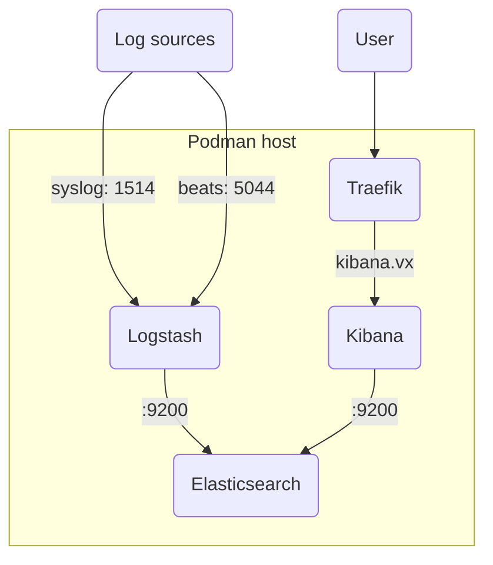
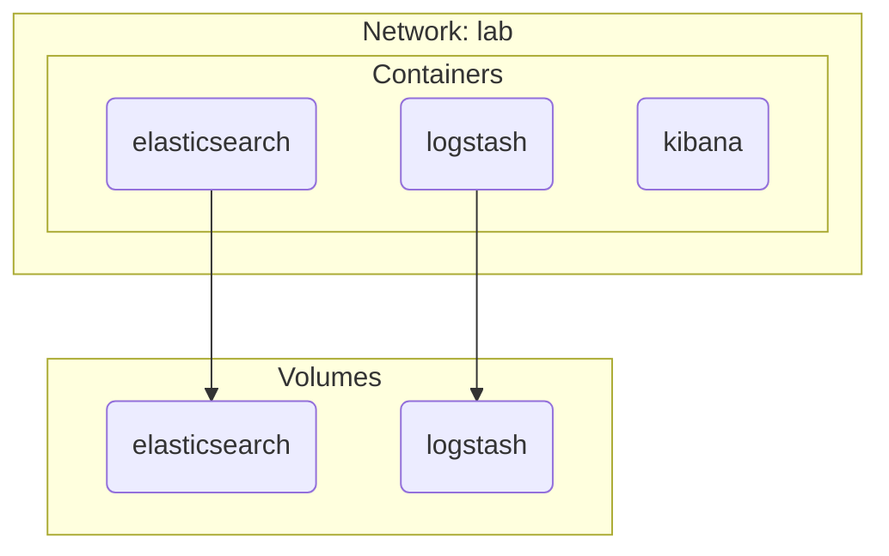
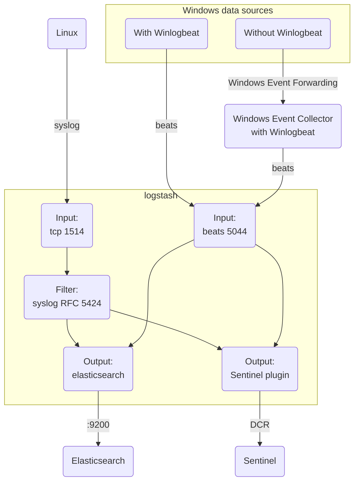

## 1. Components

### 1.1. Lab routing

```mermaid
flowchart TD
  A1(User)
  A2(Log sources)
  subgraph "Podman host"
    B(Traefik)
    C(Elasticsearch)
    D(Logstash)
    E(Kibana)
  end
  A1 --> B
  A2 --->|syslog: 1514| D
  A2 ---> |beats: 5044| D
  B -->|kibana.vx| E
  D -->|:9200| C
  E -->|:9200| C
```

### 1.2. Quadlets

```mermaid
flowchart TD
  subgraph "Network: lab"
    subgraph "Containers"
      A(elasticsearch)
      B(logstash)
      C(kibana)
    end
  end
  subgraph "Volumes"
    A1(elasticsearch)
    B1(logstash)
  end
  A --> A1
  B --> B1
```

### 1.3. Logs flow

```mermaid
flowchart TD
  subgraph Windows data sources
    A1(With Winlogbeat)
    A2(Without Winlogbeat) 
  end
  A3(Windows Event Collector<br>with Winlogbeat)
  B(Linux)
  subgraph logstash
    L1(Input:<br>tcp 1514)
    L2(Input:<br>beats 5044)
    F1(Filter:<br>syslog RFC 5424)
    O1(Output:<br>elasticsearch)
    O2(Output:<br>Sentinel plugin)
    L1 --> F1
    F1 --> O1
    F1 --> O2
    L2 ---> O1
    L2 ---> O2
  end
  A1 -->|beats| L2
  A2 -->|Windows Event Forwarding| A3
  A3 -->|beats| L2
  B --->|syslog| L1
  O1 -->|:9200| E(Elasticsearch)
  O2 -->|DCR| S(Sentinel)
```
