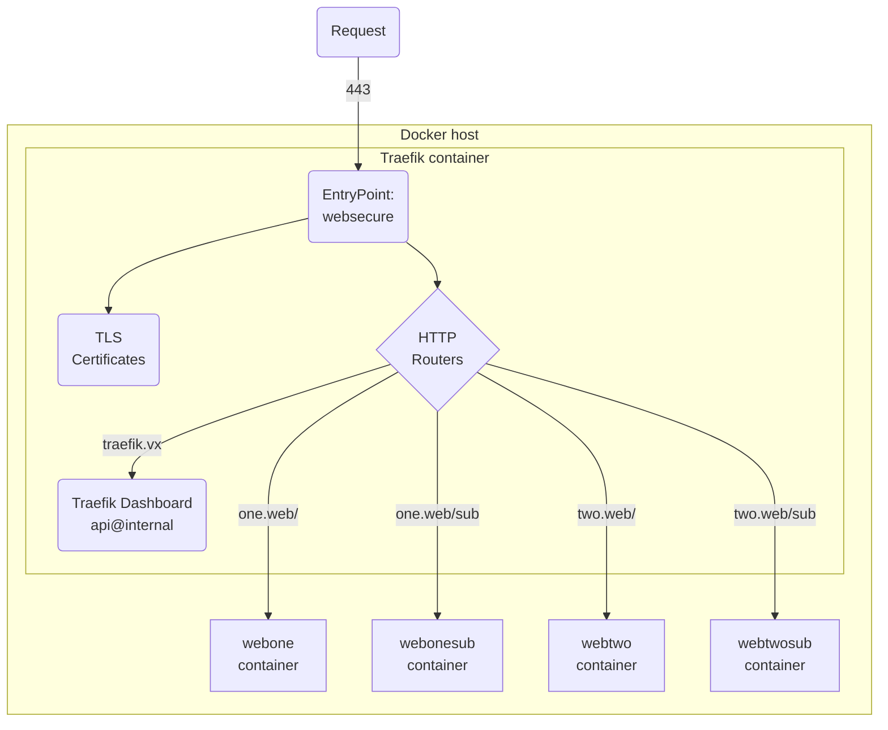

## 1. Traefik example

- Using private PKI chain from [lab-certs](https://github.com/joetanx/lab-certs)
- Scenarios to show routing based on `Host` and `PathPrefix`

Setup architecture:



## 2. Prepare certificates

Hosts:
- `one.web`
- `two.web`
- `traefik.vx` - for Traefik dashboard

Retrieve lab issuer certificates:

```sh
curl -sLO https://github.com/joetanx/lab-certs/raw/main/ca/lab_issuer.pem
curl -sLO https://github.com/joetanx/lab-certs/raw/main/ca/lab_issuer.key
```

Generate `one.web` certificate:

```sh
openssl genpkey -algorithm ec -pkeyopt ec_paramgen_curve:P-384 -out webone.key
openssl req -new -key webone.key -subj "/O=vx Lab/CN=Web Server One" -out webone.csr
echo "subjectAltName=DNS:one.web" > webone.cnf
openssl x509 -req -in webone.csr -CA lab_issuer.pem -CAkey lab_issuer.key -CAcreateserial -days 365 -sha256 -out webone.pem -extfile webone.cnf
cat lab_issuer.pem >> webone.pem
```

Generate `two.web` certificate:

```sh
openssl genpkey -algorithm ec -pkeyopt ec_paramgen_curve:P-384 -out webtwo.key
openssl req -new -key webtwo.key -subj "/O=vx Lab/CN=Web Server Two" -out webtwo.csr
echo "subjectAltName=DNS:two.web" > webtwo.cnf
openssl x509 -req -in webtwo.csr -CA lab_issuer.pem -CAkey lab_issuer.key -CAcreateserial -days 365 -sha256 -out webtwo.pem -extfile webtwo.cnf
cat lab_issuer.pem >> webtwo.pem
```

Generate `traefik.vx` certificate:

```sh
openssl genpkey -algorithm ec -pkeyopt ec_paramgen_curve:P-384 -out traefik.key
openssl req -new -key traefik.key -subj "/O=vx Lab/CN=Traefix Dashboard" -out traefik.csr
echo "subjectAltName=DNS:traefik.vx" > traefik.cnf
openssl x509 -req -in traefik.csr -CA lab_issuer.pem -CAkey lab_issuer.key -CAcreateserial -days 365 -sha256 -out traefik.pem -extfile traefik.cnf
cat lab_issuer.pem >> traefik.pem
```

## 3. Setup Traefik

Setup directories to be `-v` mounted to Traefic container:
- `/opt/traefik/dynamic`: for the Traefik dynamic configuration file
- `/opt/traefik/tls`: for certificates, move the certificates created here

```sh
mkdir -p /opt/traefik/{dynamic,tls}
mv web{one,two}.{pem,key} traefik.{pem,key} /opt/traefik/tls/
```

Download the root certificate for [lab-certs](https://github.com/joetanx/lab-certs) and place in the `/opt/traefik/tls` certificates directory:

```sh
curl -sLo /opt/traefik/tls/cacert.pem https://github.com/joetanx/lab-certs/raw/main/ca/lab_root.pem
```

Create the Traefik dynamic configuration file `/opt/traefik/dynamic/tls.yml`

> [!Tip]
>
> [Configuration](https://doc.traefik.io/traefik/getting-started/configuration-overview/) in Traefik can refer to two different things:
> - The install (startup) configuration (formerly known as the static configuration)
> - The routing configuration (formerly known as the dynamic configuration)
>
> Changes to static configuration requires Traefik restart, but changes to dynamic configuration does not require Traefik restart
>
> The static configurations can be applied to Traefik container via labels

```yaml
tls:
  certificates:
    - certFile: /etc/traefik/tls/traefik.pem
      keyFile: /etc/traefik/tls/traefik.key
    - certFile: /etc/traefik/tls/webone.pem
      keyFile: /etc/traefik/tls/webone.key
    - certFile: /etc/traefik/tls/webtwo.pem
      keyFile: /etc/traefik/tls/webtwo.key
```

Create firewall rules to allow inbound HTTPS traffic:

```sh
firewall-cmd --permanent --add-service https && firewall-cmd --reload
```

Create Docker network:

```sh
docker network create app
```

Run Traefik container:

```sh
docker run -d --restart unless-stopped --network app \
--security-opt no-new-privileges:true \
-p 443:443 \
-v /var/run/docker.sock:/var/run/docker.sock:ro \
-v /opt/traefik/tls:/etc/traefik/tls:ro \
-v /opt/traefik/dynamic:/etc/traefik/dynamic:ro \
-l traefik.enable=true \
-l "traefik.http.routers.dashboard.rule=Host(\`traefik.vx\`)" \
-l traefik.http.routers.dashboard.entrypoints=websecure \
-l traefik.http.routers.dashboard.service=api@internal \
-l traefik.http.routers.dashboard.tls=true \
--name traefik docker.io/library/traefik:latest \
--api.insecure=false \
--api.dashboard=true \
--providers.docker=true \
--providers.docker.exposedbydefault=false \
--providers.docker.network=proxy \
--providers.file.directory=/etc/traefik/dynamic \
--entryPoints.websecure.address=:443 \
--entryPoints.websecure.http.tls=true
```

> [!Note]
>
> |Option|Remark|
> |---|---|
> |`-v /var/run/docker.sock:/var/run/docker.sock:ro`|Traefik uses the Docker socket to detect new routes based on the container labels|
> |`-v /opt/traefik/...:/etc/traefik/...`|Mount the certificates and dynamic configuration directories|
> |`-l traefik.http.routers.dashboard....`|This is an example of route settings, this one is for the Traefik dashboard|
> |`--api...`, `--providers...`, `--entryPoint...`|Traefik startup (static) configuration, note that these are Docker CMDs for the container (specified after the image)|

### 3.1. Test Traefik dashboard access

When the certificates and the dynamic configuration are setup correctly, Traefik uses the certificate that has the corresponding CN or SAN:


If Traefik cannot find a certificate with the corresponding CN or SAN, it uses a default signed-self certificate:


Traefik is the only container running on the Docker host, so the dashboard shows only 1 HTTP Routers:


The HTTP services running now are the `@internal` Traefik services and the Traefik container detected through the Docker socket:


## 4. Setup test destination containers

The `traefik/whoami` container image is used to test HTTP routing and request behaviour - this container simply returns HTTP request details from the client

The labels on the destination containers specify how Traefik should route the traffic to the them

As seen with the Traefik dashboard above, the syntax for http router is: `traefik.http.routers.<service>.<setting>`

|Label|Remark|
|---|---|
|`traefik.http.routers.<service>.rule=<rule>`|Rules are a set of matchers configured with values, that determine if a particular request matches specific criteria.|
|`traefik.http.routers.<service>.entrypoints=websecure`|Specify the entry points to which the router is attached.<br>This can be a single value or a list.<br>If not specified, HTTP routers are attached to all entry points.|
|`traefik.http.routers.<service>.tls=true`|TLS configuration for the router.<br>When specified, the router will only handle HTTPS requests.|

More details: https://doc.traefik.io/traefik/reference/routing-configuration/http/routing/router/

> [!Note]
>
> By default, Traefik uses the first exposed port of a container.
>
> Setting the label `traefik.http.services.<service>.loadbalancer.server.port` overrides that behavior.
>
> e.g. `traefik.http.services.my-service.loadbalancer.server.port=12345`
>
> More details: [Specify a Custom Port for the Container](https://doc.traefik.io/traefik/reference/routing-configuration/other-providers/docker/)

### 4.1. Routing by `Host`

The rule: ``Host(`<hostname>`)`` matches traffic by hostname in the request|

#### 4.1.1. webone

```sh
docker run -d --restart unless-stopped --network app \
-l traefik.enable=true \
-l "traefik.http.routers.webone.rule=Host(\`one.web\`)" \
-l traefik.http.routers.webone.entrypoints=websecure \
-l traefik.http.routers.webone.tls=true \
--name webone docker.io/traefik/whoami
```

#### 4.1.2. webtwo

```sh
docker run -d --restart unless-stopped --network app \
-l traefik.enable=true \
-l "traefik.http.routers.webtwo.rule=Host(\`two.web\`)" \
-l traefik.http.routers.webtwo.entrypoints=websecure \
-l traefik.http.routers.webtwo.tls=true \
--name webtwo docker.io/traefik/whoami
```

### 4.2. Routing by `Host` and `PathPrefix`

The rule: ``Host(`<hostname>`) && PathPrefix(`/<path>`)`` matches traffic by hostname and path in the request

Rules support `AND` (`&&`) and `OR` (`||`) logical operators. More details: https://doc.traefik.io/traefik/reference/routing-configuration/http/routing/rules-and-priority/

> [!Note]
>
> The `PathPrefix` matcher preserves the prefix and sends the request to the corresponding path in the destination (i.e. Traefik `/sub` →  Destination `/sub`)
>
> If the desired behaviour is to "nest" the root of the destination behind a path on Traefik (i.e. Traefik `/sub` →  Destination `/`), the prefix needs to be removed when forwarding requests
> 
> The [`stripPrefix`](https://doc.traefik.io/traefik/reference/routing-configuration/http/middlewares/stripprefix/) middleware strips the matching path prefix and stores it in an `X-Forwarded-Prefix header`.
>
> The following settings configure the prefix stripping behaviour:
> - `traefik.http.routers.<service-name>.middlewares=<middleware-name>`: attaches a middleware to the HTTP router
> - `traefik.http.middlewares.<middleware-name>.stripprefix.prefixes=<path-to-strip>`: specifies the path to strip

#### 4.2.1. webonesub

```sh
docker run -d --restart unless-stopped --network app \
-l traefik.enable=true \
-l "traefik.http.routers.webonesub.rule=Host(\`one.web\`) && PathPrefix(\`/sub\`)" \
-l "traefik.http.routers.webonesub.middlewares=webonesub-stripprefix" \
-l "traefik.http.middlewares.webonesub-stripprefix.stripprefix.prefixes=/sub" \
-l traefik.http.routers.webonesub.entrypoints=websecure \
-l traefik.http.routers.webonesub.tls=true \
--name webonesub docker.io/traefik/whoami
```

#### 4.2.2. webtwosub

```sh
docker run -d --restart unless-stopped --network app \
-l traefik.enable=true \
-l "traefik.http.routers.webtwosub.rule=Host(\`two.web\`) && PathPrefix(\`/sub\`)" \
-l "traefik.http.routers.webtwosub.middlewares=webtwosub-stripprefix" \
-l "traefik.http.middlewares.webtwosub-stripprefix.stripprefix.prefixes=/sub" \
-l traefik.http.routers.webtwosub.entrypoints=websecure \
-l traefik.http.routers.webtwosub.tls=true \
--name webtwosub docker.io/traefik/whoami
```

### 4.3. Verify updates on Traefik dashboard

Traefik picks up the HTTP routers and services configured in the test containers via the Docker socket:


The strip prefix middlewares are also listed:


## 5. Testing routing

### 5.1. one.web

Traefik used the _Web Server One_ certificate for requests to `one.web`


#### `https://one.web`

Request for `one.web` hostname went to the `webone` container at `172.18.0.3` and the requested path seen by the container is `/`

```http
Hostname: 169be963b696
IP: 127.0.0.1
IP: ::1
IP: 172.18.0.3
RemoteAddr: 172.18.0.2:35628
GET / HTTP/1.1
User-Agent: Mozilla/5.0 (Windows NT 10.0; Win64; x64) AppleWebKit/537.36 (KHTML, like Gecko) Chrome/142.0.0.0 Safari/537.36 Edg/142.0.0.0
Accept: text/html,application/xhtml+xml,application/xml;q=0.9,image/avif,image/webp,image/apng,*/*;q=0.8,application/signed-exchange;v=b3;q=0.7
Accept-Encoding: gzip, deflate, br, zstd
Accept-Language: en-US,en;q=0.9
Priority: u=0, i
Sec-Ch-Ua: "Chromium";v="142", "Microsoft Edge";v="142", "Not_A Brand";v="99"
Sec-Ch-Ua-Mobile: ?0
Sec-Ch-Ua-Platform: "Windows"
Sec-Fetch-Dest: document
Sec-Fetch-Mode: navigate
Sec-Fetch-Site: none
Sec-Fetch-User: ?1
Upgrade-Insecure-Requests: 1
X-Forwarded-For: 192.168.84.11
X-Forwarded-Host: one.web
X-Forwarded-Port: 443
X-Forwarded-Proto: https
X-Forwarded-Server: a2bc03a507eb
X-Real-Ip: 192.168.84.11
```

#### `https://one.web/blahblahblah`

Similar to above, the request went to the `webone` container at `172.18.0.3` and the requested path seen by the container is `/blahblahblah` according to the client's request

```http
Hostname: 169be963b696
IP: 127.0.0.1
IP: ::1
IP: 172.18.0.3
RemoteAddr: 172.18.0.2:35628
GET /blahblahblah HTTP/1.1
User-Agent: Mozilla/5.0 (Windows NT 10.0; Win64; x64) AppleWebKit/537.36 (KHTML, like Gecko) Chrome/142.0.0.0 Safari/537.36 Edg/142.0.0.0
Accept: text/html,application/xhtml+xml,application/xml;q=0.9,image/avif,image/webp,image/apng,*/*;q=0.8,application/signed-exchange;v=b3;q=0.7
Accept-Encoding: gzip, deflate, br, zstd
Accept-Language: en-US,en;q=0.9
Priority: u=0, i
Sec-Ch-Ua: "Chromium";v="142", "Microsoft Edge";v="142", "Not_A Brand";v="99"
Sec-Ch-Ua-Mobile: ?0
Sec-Ch-Ua-Platform: "Windows"
Sec-Fetch-Dest: document
Sec-Fetch-Mode: navigate
Sec-Fetch-Site: none
Sec-Fetch-User: ?1
Upgrade-Insecure-Requests: 1
X-Forwarded-For: 192.168.84.11
X-Forwarded-Host: one.web
X-Forwarded-Port: 443
X-Forwarded-Proto: https
X-Forwarded-Server: a2bc03a507eb
X-Real-Ip: 192.168.84.11
```

#### `https://one.web/sub`

As configured in the `webonesub` HTTP router, request to `one.web` AND `/sub` is sent to `webonesub` container at `172.18.0.5`

The `/sub` is stripped when forwarding the request, and the requested path seen by the container is `/`

```http
Hostname: c9cdbf7a0934
IP: 127.0.0.1
IP: ::1
IP: 172.18.0.5
RemoteAddr: 172.18.0.2:43072
GET / HTTP/1.1
Host: one.web
User-Agent: Mozilla/5.0 (Windows NT 10.0; Win64; x64) AppleWebKit/537.36 (KHTML, like Gecko) Chrome/142.0.0.0 Safari/537.36 Edg/142.0.0.0
Accept: text/html,application/xhtml+xml,application/xml;q=0.9,image/avif,image/webp,image/apng,*/*;q=0.8,application/signed-exchange;v=b3;q=0.7
Accept-Encoding: gzip, deflate, br, zstd
Accept-Language: en-US,en;q=0.9
Priority: u=0, i
Sec-Ch-Ua: "Chromium";v="142", "Microsoft Edge";v="142", "Not_A Brand";v="99"
Sec-Ch-Ua-Mobile: ?0
Sec-Ch-Ua-Platform: "Windows"
Sec-Fetch-Dest: document
Sec-Fetch-Mode: navigate
Sec-Fetch-Site: none
Sec-Fetch-User: ?1
Upgrade-Insecure-Requests: 1
X-Forwarded-For: 192.168.84.11
X-Forwarded-Host: one.web
X-Forwarded-Port: 443
X-Forwarded-Prefix: /sub
X-Forwarded-Proto: https
X-Forwarded-Server: a2bc03a507eb
X-Real-Ip: 192.168.84.11
```

### 5.2. two.web

Traefik used the _Web Server Two_ certificate for requests to `two.web`


#### `https://two.web`

Request for `two.web` hostname went to the `webtwo` container at `172.18.0.4` and the requested path seen by the container is `/`

```http
Hostname: af68c41a9f29
IP: 127.0.0.1
IP: ::1
IP: 172.18.0.4
RemoteAddr: 172.18.0.2:38106
GET / HTTP/1.1
Host: two.web
User-Agent: Mozilla/5.0 (Windows NT 10.0; Win64; x64) AppleWebKit/537.36 (KHTML, like Gecko) Chrome/142.0.0.0 Safari/537.36 Edg/142.0.0.0
Accept: text/html,application/xhtml+xml,application/xml;q=0.9,image/avif,image/webp,image/apng,*/*;q=0.8,application/signed-exchange;v=b3;q=0.7
Accept-Encoding: gzip, deflate, br, zstd
Accept-Language: en-US,en;q=0.9
Priority: u=0, i
Sec-Ch-Ua: "Chromium";v="142", "Microsoft Edge";v="142", "Not_A Brand";v="99"
Sec-Ch-Ua-Mobile: ?0
Sec-Ch-Ua-Platform: "Windows"
Sec-Fetch-Dest: document
Sec-Fetch-Mode: navigate
Sec-Fetch-Site: none
Sec-Fetch-User: ?1
Upgrade-Insecure-Requests: 1
X-Forwarded-For: 192.168.84.11
X-Forwarded-Host: two.web
X-Forwarded-Port: 443
X-Forwarded-Proto: https
X-Forwarded-Server: a2bc03a507eb
X-Real-Ip: 192.168.84.11
```

#### `https://two.web/blahblahblah`

Similar to above, the request went to the `webtwo` container at `172.18.0.4` and the requested path seen by the container is `/blahblahblah` according to the client's request

```http
Hostname: af68c41a9f29
IP: 127.0.0.1
IP: ::1
IP: 172.18.0.4
RemoteAddr: 172.18.0.2:38106
GET /blahblahblah HTTP/1.1
Host: two.web
User-Agent: Mozilla/5.0 (Windows NT 10.0; Win64; x64) AppleWebKit/537.36 (KHTML, like Gecko) Chrome/142.0.0.0 Safari/537.36 Edg/142.0.0.0
Accept: text/html,application/xhtml+xml,application/xml;q=0.9,image/avif,image/webp,image/apng,*/*;q=0.8,application/signed-exchange;v=b3;q=0.7
Accept-Encoding: gzip, deflate, br, zstd
Accept-Language: en-US,en;q=0.9
Priority: u=0, i
Sec-Ch-Ua: "Chromium";v="142", "Microsoft Edge";v="142", "Not_A Brand";v="99"
Sec-Ch-Ua-Mobile: ?0
Sec-Ch-Ua-Platform: "Windows"
Sec-Fetch-Dest: document
Sec-Fetch-Mode: navigate
Sec-Fetch-Site: none
Sec-Fetch-User: ?1
Upgrade-Insecure-Requests: 1
X-Forwarded-For: 192.168.84.11
X-Forwarded-Host: two.web
X-Forwarded-Port: 443
X-Forwarded-Proto: https
X-Forwarded-Server: a2bc03a507eb
X-Real-Ip: 192.168.84.11
```

#### `https://two.web/sub`

As configured in the `webtwosub` HTTP router, request to `two.web` AND `/sub` is sent to `webtwosub` container at `172.18.0.6`

The `/sub` is stripped when forwarding the request, and the requested path seen by the container is `/`

```http
Hostname: 4f62be807db1
IP: 127.0.0.1
IP: ::1
IP: 172.18.0.6
RemoteAddr: 172.18.0.2:54778
GET / HTTP/1.1
Host: two.web
User-Agent: Mozilla/5.0 (Windows NT 10.0; Win64; x64) AppleWebKit/537.36 (KHTML, like Gecko) Chrome/142.0.0.0 Safari/537.36 Edg/142.0.0.0
Accept: text/html,application/xhtml+xml,application/xml;q=0.9,image/avif,image/webp,image/apng,*/*;q=0.8,application/signed-exchange;v=b3;q=0.7
Accept-Encoding: gzip, deflate, br, zstd
Accept-Language: en-US,en;q=0.9
Priority: u=0, i
Sec-Ch-Ua: "Chromium";v="142", "Microsoft Edge";v="142", "Not_A Brand";v="99"
Sec-Ch-Ua-Mobile: ?0
Sec-Ch-Ua-Platform: "Windows"
Sec-Fetch-Dest: document
Sec-Fetch-Mode: navigate
Sec-Fetch-Site: none
Sec-Fetch-User: ?1
Upgrade-Insecure-Requests: 1
X-Forwarded-For: 192.168.84.11
X-Forwarded-Host: two.web
X-Forwarded-Port: 443
X-Forwarded-Prefix: /sub
X-Forwarded-Proto: https
X-Forwarded-Server: a2bc03a507eb
X-Real-Ip: 192.168.84.11
```
