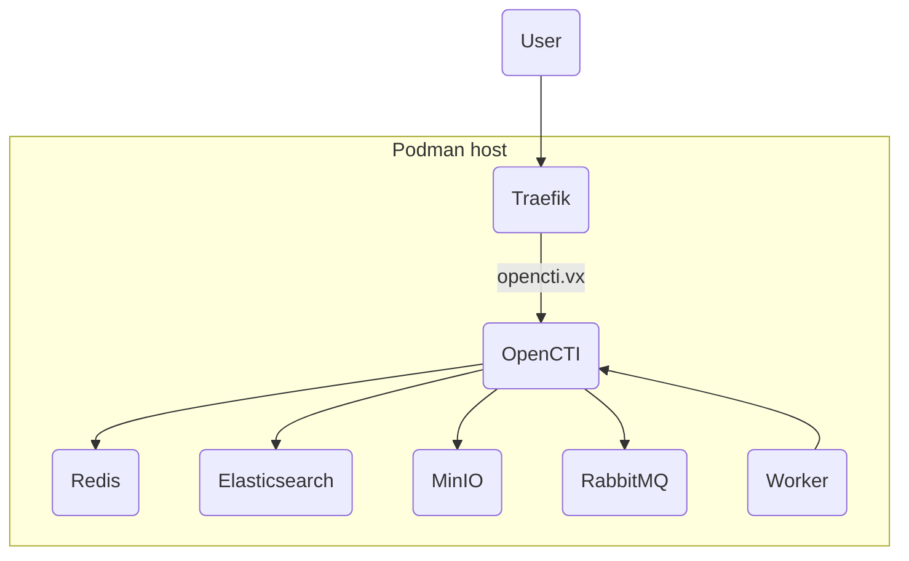
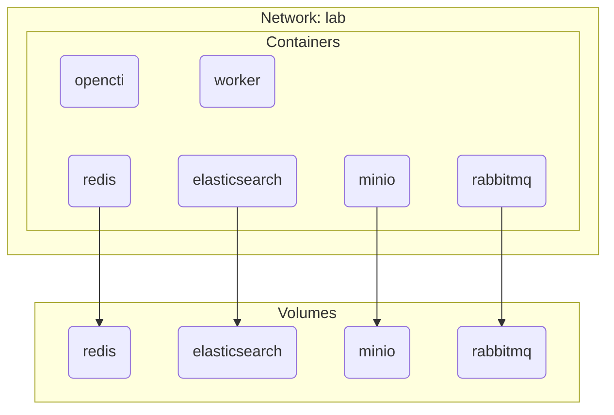

## 1. Components

### 1.1. Lab routing



### 1.2. Quadlets



## 2. Setup OpenCTI Platform

Download the quadlet unit files and reload systemd:

```sh
curl -sL --output-dir /etc/containers/systemd/ -O https://github.com/joetanx/setup/raw/refs/heads/main/elastic/quadlets/elasticsearch.container
curl -sL --output-dir /etc/containers/systemd/ -O https://github.com/joetanx/setup/raw/refs/heads/main/elastic/quadlets/elasticsearch.volume
for item in minio.container minio.volume opencti.container rabbitmq.container rabbitmq.volume redis.container redis.volume worker.container; do
  curl -sL --output-dir /etc/containers/systemd/ -O https://github.com/joetanx/setup/raw/refs/heads/main/opencti/quadlets/$item
done
systemctl daemon-reload
```

Pull container image (optional) and start service:

```sh
podman pull docker.io/library/redis:latest
podman pull docker.io/elastic/elasticsearch:9.2.3
podman pull docker.io/minio/minio:latest
podman pull docker.io/library/rabbitmq:management
podman pull docker.io/opencti/platform:latest
podman pull docker.io/opencti/worker:latest
systemctl start worker
```

> [!Tip]
>
> Notice that only worker needs to be started
> 
> In the systemd uni file, worker `requires` opencti, which `requires` redis, elasticsearch, minio and rabbitmq
>
> This chain of `requires` means starting worker will automatically start all the `requires`
>
> ```mermaid
> flowchart LR
>   A(worker) --> B(opencti)
>   B --> C(redis)
>   B --> D(elasticsearch)
>   B --> E(minio)
>   B --> F(rabbitmq)
> ```

Check status:

```sh
systemctl status redis elasticsearch minio rabbitmq opencti worker
podman logs redis
podman logs elasticsearch
podman logs minio
podman logs rabbitmq
podman logs opencti
podman logs worker
```

## 3. Connectors

Download the quadlet unit files:

```sh
for item in connector-abuseipdb.container connector-alienvault.container connector-malwarebazaar.container connector-threatfox.container connector-urlhaus.container connector-virustotal.container; do
  curl -sL --output-dir /etc/containers/systemd/ -O https://github.com/joetanx/setup/raw/refs/heads/main/opencti/quadlets/$item
done
```

Replace placeholders for AbuseIPDB, AlienVault, VirusTotal and MalwareBazaar:

```sh
sed -i 's/YOUR_API_KEY_HERE/<abuseipdb-api-key>/' /etc/containers/systemd/connector-abuseipdb.container
sed -i 's/YOUR_API_KEY_HERE/<alienvault-api-key>/' /etc/containers/systemd/connector-alienvault.container
sed -i "s/CONNECTOR_TIMESTAMP_HERE/$(date -d '1 day ago' '+%Y-%m-%dT%H:%M:%S')/" /etc/containers/systemd/connector-alienvault.container
sed -i 's/YOUR_API_KEY_HERE/<virustotal-api-key>/' /etc/containers/systemd/connector-virustotal.container
sed -i 's/YOUR_API_KEY_HERE/<malwarebazaar-api-key>/' /etc/containers/systemd/connector-malwarebazaar.container
```

Reload systemd:

```sh
systemctl daemon-reload
```

Pull container image (optional) and start services:

```sh
podman pull docker.io/opencti/connector-abuseipdb-ipblacklist:latest
podman pull docker.io/opencti/connector-alienvault:latest
podman pull docker.io/opencti/connector-malwarebazaar:latest
podman pull docker.io/opencti/connector-threatfox:latest
podman pull docker.io/opencti/connector-urlhaus:latest
podman pull docker.io/opencti/connector-virustotal:latest
systemctl start connector-abuseipdb connector-alienvault connector-malwarebazaar connector-threatfox connector-urlhaus connector-virustotal
```

The connector containers has no logs when it's working fine (no news mean good news?), `podman logs` can be used with `--color`, `--names` and `--timestamps` options to quickly see all the logs:

```sh
podman logs --color -nt connector-abuseipdb connector-alienvault connector-malwarebazaar connector-threatfox connector-urlhaus connector-virustotal
```

## 4. Exploring OpenCTI console

#### Ingestion status

Data → Ingestion


#### Home dashboard


#### Reports

Analyses → Reports


#### External references

Analyses → External references


#### Oberservables

Oberservations → Oberservables


#### Indicators

Oberservations → Indicators


#### Intrusion sets

Threats → Intrusion sets


#### Malware

Arsenal → Malware


#### Vulnerabilities

Arsenal → Vulnerabilities


#### Attack patterns

Techniques → Attack patterns


