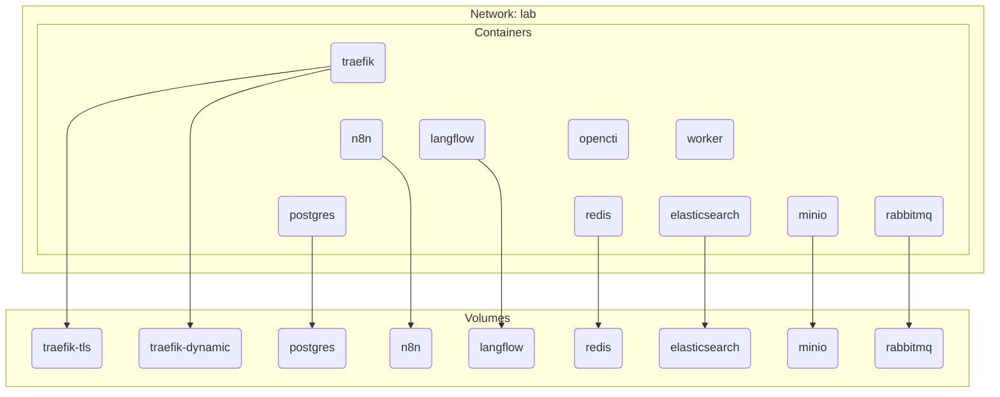

## 1. Setup podman

```sh
yum -y install podman
systemctl enable --now podman
```

### 1.1. Basic podman commands

Pull container image

```sh
podman pull docker.io/library/nginx
```

Podman run example:

```sh
docker run -d --name nginx \
--restart unless-stopped -p 80:80 \
-v /etc/nginx/nginx.conf:/etc/nginx/nginx.conf:ro \
-e DB_USER=app \
-e DB_PASSWORD=donotembedpasswordinenv \
-l traefik.enable=true \
-l "traefik.http.routers.whoami.rule=Host(\`web.lab.vx\`)" \
-l traefik.http.routers.whoami.entrypoints=websecure \
-l traefik.http.routers.whoami.tls=true \
docker.io/library/nginx:latest
```

|Option|Purpose|
|---|---|
|`-d`, `--detach`|Run container in background and print container ID|
|`-it`: `--interactive` + `--tty`|Keep STDIN open even if not attached + Allocate a pseudo-TTY|
|`--name <string>`|Assign a name to the container|
|`--restart <string>`|Restart policy to apply when a container exits (default "no")|
|`--rm`|Automatically remove the container and its associated anonymous volumes when it exits<br>• use with `-d`: container runs like a process and discard itself after<br>• use with `-it`: usually for containers that are client utilities, interact and discard after|
|`-p`, `--publish` `<host_port>:<container_port>`|Publish a container's port(s) to the host|
|`-e`, `--env` `<key>=<value>`|Set environment variables|
|`-v`, `--volume` `<host_dir>:<container_dir>:<options>`|Bind mount a volume<br>SELinux options<br>• `:z`: sets shared SELinux label (share volume to multiple containers)<br>• `:Z`: sets private SELinux label (volume used by only one container)<br>• `:ro`: mounts volume as read-only mode<br>• `rw` (default): mounts volume as read-write mode|
|`-l`, `--label` `<key>=<value>`|Set meta data on a container|
|`--network <network>`|Connect a container to a network|
|`--network-alias <list>`|Add network-scoped alias for the container|

Firewall commands to allow access to the container service mapped to the host port

```sh
firewall-cmd --permanent --add-service http && firewall-cmd --reload
```

<details><summary><h3>1.2. Install Docker on Red Hat or Rocky Linux</h3></summary>

```sh
yum config-manager --add-repo https://download.docker.com/linux/rhel/docker-ce.repo
yum -y install docker-ce docker-ce-cli containerd.io docker-buildx-plugin docker-compose-plugin
systemctl enable --now docker
```

</details>

## 2. Podman quadlets



Docker Compose is a popular supported deployment method for various services such as [n8n](https://github.com/n8n-io/n8n-hosting/tree/main/docker-compose/withPostgres), [Langflow](https://github.com/langflow-ai/langflow/docker_example) and [OpenCTI](https://github.com/OpenCTI-Platform/docker/)

Podman [quadlet](https://docs.podman.io/en/latest/markdown/podman-systemd.unit.5.html) is useful because components are managed independently under its respective systemd unit file
- Quadlet files are located at `/etc/containers/systemd/`
- Define podman networks, volumes and containers with respective `.network`, `.volume` and `.container` files

Differences on managing changes:
- Docker compose: edit the `docker-compose.yaml`, run `docker compose up -d`
- Podman quadlet: download the affected systemd unit file, `systemctl daemon-reload`, `systemctl restart <service>`

> [!Tip]
>
> Unlike normal systemd services, there is no need to `systemctl enable` any of the podman quadlets; they always start on boot

## 3. Container name resolution

The behavior of container name resolution is documented in [Docker networking](https://docs.docker.com/engine/network/#container-networks):
- By default, containers inherit the DNS settings as defined in the `/etc/resolv.conf` configuration file. Containers that attach to the default `bridge` network receive a copy of this file.
- Containers that attach to a [custom network](https://docs.docker.com/engine/network/tutorials/standalone/#use-user-defined-bridge-networks) use Docker's embedded DNS server. The embedded DNS server forwards external DNS lookups to the DNS servers configured on the host.

### 3.1. Containers on default `podman` network cannot communicate using container names

Run a nginx and a client container:

```sh
podman run -d --name nginx docker.io/library/nginx
podman run -it --name client docker.io/library/alpine
```

Check that both containers are on the `bridge` network:

```console
[root@podman ~]# podman network inspect podman
[
  {
    "Name": "podman",
    ⋮
    "containers": {
       "441edcaa494df3ed0c604aa22d211ad0a2e97d625b96865ca0950df3bd666849": {
        "name": "client",
        "interfaces": {
           "eth0": {
              "subnets": [
                 {
                  "ipnet": "10.88.0.3/16",
                  "gateway": "10.88.0.1"
                 }
              ],
              "mac_address": "de:5f:d7:85:c9:2d"
           }
        }
       },
       "9340fe192fcb7d9f85f4bce2188eb1b18efaf9d00887bb40576f3406de284ac7": {
        "name": "nginx",
        "interfaces": {
           "eth0": {
              "subnets": [
                 {
                  "ipnet": "10.88.0.2/16",
                  "gateway": "10.88.0.1"
                 }
              ],
              "mac_address": "8e:5d:6f:71:90:f5"
           }
        }
      }
    }
    ⋮
```

Attempt to ping nginx from client fails:

```sh
/ # ping nginx
ping: bad address 'nginx'
```

This is because the podman host's DNS server is populated in containers' `/etc/resolv.conf` in default `podman` network:

```sh
/ # cat /etc/resolv.conf
search vx
nameserver 192.168.17.1
```

> [!Tip]
>
> ### Useful container diagnostic commands
>
> 1. get a console to the nginx container:
>
> ```sh
> podman exec -it nginx /bin/bash
> ```
>
> 2. get IP address of the nginx container:
>
> ```sh
> podman exec nginx hostname -i
> ```
>
> 3. `wget` to print web request to stdout:
>
> ```sh
> wget -O - http://nginx
> ```
>
> 4. remove containers (`-f` removes non running containers too):
>
> ```sh
> podman rm -f nginx client
> ```

### 3.2. Containers on custom network can communicate using container names

Create a docker network:

```sh
podman network create app
```

Run a nginx and a client container on the custom network:

```sh
podman run -d --name nginx --network app docker.io/library/nginx
podman run -it --name client --network app docker.io/library/alpine
```

Check that both containers are on the custom network:

```console
[root@podman ~]# podman network inspect app
[
  {
    "Name": "app",
    ⋮
    "containers": {
       "29d6c6dcad1060fe5e374fcc74cdcb80392ba86940d73708b21e4195f3953570": {
        "name": "nginx",
        "interfaces": {
           "eth0": {
              "subnets": [
                 {
                  "ipnet": "10.89.0.2/24",
                  "gateway": "10.89.0.1"
                 }
              ],
              "mac_address": "22:82:b6:d6:2a:01"
           }
        }
       },
       "5c67fbea62b75afa52ae30d458830889fde11b1c9f5a6578d0c6b103c35eddf7": {
        "name": "client",
        "interfaces": {
           "eth0": {
              "subnets": [
                 {
                  "ipnet": "10.89.0.3/24",
                  "gateway": "10.89.0.1"
                 }
              ],
              "mac_address": "3a:d7:f4:57:1d:82"
           }
        }
       }
    }
    ⋮
```

Attempt to connect nginx from client works:

```sh
/ # ping nginx -c 1
PING nginx (10.89.0.2): 56 data bytes
64 bytes from 10.89.0.2: seq=0 ttl=42 time=0.020 ms

--- nginx ping statistics ---
1 packets transmitted, 1 packets received, 0% packet loss
round-trip min/avg/max = 0.020/0.020/0.020 ms
/ # wget -O /dev/null nginx
Connecting to nginx (10.89.0.2:80)
saving to '/dev/null'
null                 100% |********************************|   615  0:00:00 ETA
'/dev/null' saved
```

This is because the podman embedded DNS server is populated in containers' `/etc/resolv.conf` in custom networks:

```sh
/ # cat /etc/resolv.conf
search dns.podman vx
nameserver 10.89.0.1
```

## 3.3. Running containers with aliases

Running a container with network aliases creates DNS records for the aliases

```sh
podman run -d --name nginx \
--network app \
--network-alias webserver \
--network-alias api \
docker.io/library/nginx
```

Client can reach nginx by any of the network names:

```sh
/ # ping nginx -c 1
PING nginx (10.89.0.4): 56 data bytes
64 bytes from 10.89.0.4: seq=0 ttl=42 time=0.051 ms

--- nginx ping statistics ---
1 packets transmitted, 1 packets received, 0% packet loss
round-trip min/avg/max = 0.051/0.051/0.051 ms
/ # ping webserver -c 1
PING webserver (10.89.0.4): 56 data bytes
64 bytes from 10.89.0.4: seq=0 ttl=42 time=0.036 ms

--- webserver ping statistics ---
1 packets transmitted, 1 packets received, 0% packet loss
round-trip min/avg/max = 0.036/0.036/0.036 ms
/ # ping api -c 1
PING api (10.89.0.4): 56 data bytes
64 bytes from 10.89.0.4: seq=0 ttl=42 time=0.083 ms

--- api ping statistics ---
1 packets transmitted, 1 packets received, 0% packet loss
round-trip min/avg/max = 0.083/0.083/0.083 ms
```

## 4. Volume mounts and SELinux

Ref: https://developers.redhat.com/articles/2025/04/11/my-advice-selinux-container-labeling

```console
[root@podman ~]# mkdir /opt/test
[root@podman ~]# echo 'test file' > /opt/test/file.txt
[root@podman ~]# ls -lZd /opt/test
drwxr-xr-x. 2 root root unconfined_u:object_r:usr_t:s0 22 Dec 15 19:49 /opt/test
[root@podman ~]# ls -lZ /opt/test/
total 4
-rw-r--r--. 1 root root unconfined_u:object_r:usr_t:s0 10 Dec 15 19:49 file.txt
```

### 4.1. Mount volume without any options

By default, the volumes are mounted read-write (more: [volume mount options](https://docs.podman.io/en/v5.0.1/markdown/podman-run.1.html#volume-v-source-volume-host-dir-container-dir-options))

```sh
podman run -it --name client --network app -v /opt/test:/test docker.io/library/alpine
```

Permission denied when attempting to write to mounted volume:

```console
/ # ls -l /test
total 4
-rw-r--r--    1 root     root            10 Dec 15 11:49 file.txt
/ # cat /test/file.txt
test file
/ # echo 'test test' > /test/file2.txt
/bin/sh: can't create /test/file2.txt: Permission denied
```

The mismatch of SELinux labels is logs in Access Vector Cache (AVC):

(`scontext=system_u:system_r:container_t:s0:c354,c737` vs `tcontext=unconfined_u:object_r:usr_t:s0`)

More: [How to read and correct SELinux denial messages](https://www.redhat.com/en/blog/selinux-denial2)

```console
[root@podman ~]# ausearch -m avc -ts recent
⋮
type=PROCTITLE msg=audit(1765799435.535:344): proctitle="/bin/sh"
type=SYSCALL msg=audit(1765799435.535:344): arch=c000003e syscall=2 success=no exit=-13 a0=7fc9972141f0 a1=8241 a2=1b6 a3=0 items=0 ppid=2941 pid=2943 auid=0 uid=0 gid=0 euid=0 suid=0 fsuid=0 egid=0 sgid=0 fsgid=0 tty=pts0 ses=3 comm="sh" exe="/bin/busybox" subj=system_u:system_r:container_t:s0:c354,c737 key=(null)
type=AVC msg=audit(1765799435.535:344): avc:  denied  { write } for  pid=2943 comm="sh" name="test" dev="sda3" ino=265123 scontext=system_u:system_r:container_t:s0:c354,c737 tcontext=unconfined_u:object_r:usr_t:s0 tclass=dir permissive=0
```

### 4.2. Run container with SELinux separation disabled 

Container security options can be set to tweak SELinux behavior for the containers

#### 4.2.1. `--security-opt label=disabled`

- Completely disables SELinux labeling for the container
- No SELinux logging at all
- Containers run with the `--privileged` flag or with `--pid=host` or `--ipc=host` also set this option

```sh
podman run -it --rm --name client --network app -v /opt/test:/test --security-opt label=disable docker.io/library/alpine
```

Creates file successfully:

```console
/ # echo 'test --security-opt label=disabled' > /test/file2.txt
/ # cat /test/file2.txt
test --security-opt label=disabled
```

The SELinux label on the file created follows the directory, since SELinux is simply not enforced on the container:

```console
[root@podman ~]# ls -lZ /opt/test/
total 8
-rw-r--r--. 1 root root unconfined_u:object_r:usr_t:s0 35 Dec 15 20:22 file2.txt
-rw-r--r--. 1 root root unconfined_u:object_r:usr_t:s0 10 Dec 15 19:49 file.txt
```

#### 4.2.2. `--security-opt label=type:spc_t`

- Sets the container to use the Super Privileged Container (SPC) SELinux type
- SELinux still logs access attempts (useful for security monitoring)

```sh
podman run -it --rm --name client --network app -v /opt/test:/test --security-opt label=type:spc_t docker.io/library/alpine
```

Creates file successfully:

```console
/ # echo 'test --security-opt label=type:spc_t' > /test/file3.txt
/ # cat /test/file3.txt
test --security-opt label=type:spc_t
```

The SELinux label on the file created is set to `system_u:object_r:usr_t:s0`

```console
[root@podman ~]# ls -lZ /opt/test/
total 12
-rw-r--r--. 1 root root unconfined_u:object_r:usr_t:s0 35 Dec 15 20:22 file2.txt
-rw-r--r--. 1 root root system_u:object_r:usr_t:s0     37 Dec 15 20:23 file3.txt
-rw-r--r--. 1 root root unconfined_u:object_r:usr_t:s0 10 Dec 15 19:49 file.txt
```

### 4.3. Volume mount with `:z` or `:Z` option

- `:z`: sets shared SELinux label (share volume to multiple containers)
- `:Z`: sets private SELinux label (volume used by only one container)

```sh
podman run -it --rm --name client --network app -v /opt/test:/test:Z --security-opt label=type:spc_t docker.io/library/alpine
```

The SELinux labels of the directory and everything below it is changed to `system_u:object_r:container_file_t:s0`

```console
[root@podman ~]# ls -lZd /opt/test
drwxr-xr-x. 2 root root system_u:object_r:container_file_t:s0:c677,c851 56 Dec 15 20:23 /opt/test
[root@podman ~]# ls -lZ /opt/test/
total 12
-rw-r--r--. 1 root root system_u:object_r:container_file_t:s0:c677,c851 35 Dec 15 20:22 file2.txt
-rw-r--r--. 1 root root system_u:object_r:container_file_t:s0:c677,c851 37 Dec 15 20:23 file3.txt
-rw-r--r--. 1 root root system_u:object_r:container_file_t:s0:c677,c851 10 Dec 15 19:49 file.txt
```

### 4.4. Creating a podman volume

Creating a volume with `podman volume create` lets podman handle the SELinux labeling

```sh
podman volume create test
podman run -it --rm --name client --network app -v test:/test --security-opt label=type:spc_t docker.io/library/alpine
```

```console
/ # echo 'test podman created volume' > /test/file.txt
/ # cat /test/file.txt
test podman created volume
```

Podman volumes are created at `/var/lib/containers/storage/volumes/<name>/_data` with SELinux label `system_u:object_r:container_file_t:s0`:

```console
[root@delta ~]# podman volume inspect test
[
     {
          "Name": "test",
          "Driver": "local",
          "Mountpoint": "/var/lib/containers/storage/volumes/test/_data",
          "CreatedAt": "2025-12-15T20:37:30.51545781+08:00",
          "Labels": {},
          "Scope": "local",
          "Options": {},
          "MountCount": 0,
          "NeedsCopyUp": true,
          "NeedsChown": true,
          "LockNumber": 0
     }
]
[root@delta ~]# ls -lZR /var/lib/containers/storage/volumes/
/var/lib/containers/storage/volumes/:
total 0
drwx------. 3 root root unconfined_u:object_r:container_var_lib_t:s0 19 Dec 15 20:37 test

/var/lib/containers/storage/volumes/test:
total 0
drwxr-xr-x. 2 root root system_u:object_r:container_file_t:s0 22 Dec 15 20:42 _data

/var/lib/containers/storage/volumes/test/_data:
total 4
-rw-r--r--. 1 root root system_u:object_r:container_file_t:s0 27 Dec 15 20:42 file.txt
```
