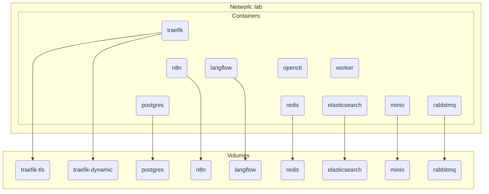

## 1. Setup podman

```sh
yum -y install podman
systemctl enable --now podman
```

## 2. Podman quadlets



Docker Compose is a popular supported deployment method for various services such as [n8n](https://github.com/n8n-io/n8n-hosting/tree/main/docker-compose/withPostgres), [Langflow](https://github.com/langflow-ai/langflow/docker_example) and [OpenCTI](https://github.com/OpenCTI-Platform/docker/)

Podman [quadlet](https://docs.podman.io/en/latest/markdown/podman-systemd.unit.5.html) is useful because components are managed independently under its respective systemd unit file

Differences on managing changes:
- Docker compose: edit the `docker-compose.yaml`, run `docker compose up -d`
- Podman quadlet: download the affected systemd unit file, `systemctl daemon-reload`, `systemctl restart <service>`

> [!Tip]
>
> Unlike normal systemd services, there is no need to `systemctl enable` any of the podman quadlets; they always start on boot
