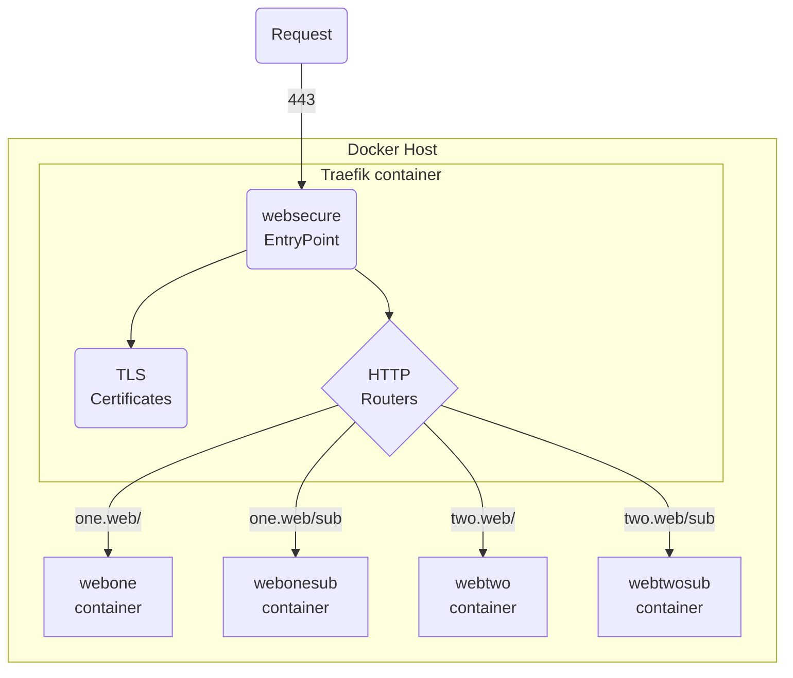

## 1. Traefik example

- Using private PKI chain based on [lab-certs](https://github.com/joetanx/lab-certs)
- Scenarios to show routing based on `Host` and `PathPrefix`

Setup architecture:



## 2. Prepare certificates

Hosts:
- `one.web`
- `two.web`
- `traefik.vx` - for Traefik dashboard

Retrieve lab issuer certificates:

```sh
curl -sLO https://github.com/joetanx/lab-certs/raw/main/ca/lab_issuer.pem
curl -sLO https://github.com/joetanx/lab-certs/raw/main/ca/lab_issuer.key
```

Generate `one.web` certificate:

```sh
openssl genpkey -algorithm ec -pkeyopt ec_paramgen_curve:P-384 -out webone.key
openssl req -new -key webone.key -subj "/O=vx Lab/CN=Web Server One" -out webone.csr
echo "subjectAltName=DNS:one.web" > webone.cnf
openssl x509 -req -in webone.csr -CA lab_issuer.pem -CAkey lab_issuer.key -CAcreateserial -days 365 -sha256 -out webone.pem -extfile webone.cnf
cat lab_issuer.pem >> webone.pem
```

Generate `two.web` certificate:

```sh
openssl genpkey -algorithm ec -pkeyopt ec_paramgen_curve:P-384 -out webtwo.key
openssl req -new -key webtwo.key -subj "/O=vx Lab/CN=Web Server Two" -out webtwo.csr
echo "subjectAltName=DNS:two.web" > webtwo.cnf
openssl x509 -req -in webtwo.csr -CA lab_issuer.pem -CAkey lab_issuer.key -CAcreateserial -days 365 -sha256 -out webtwo.pem -extfile webtwo.cnf
cat lab_issuer.pem >> webtwo.pem
```

Generate `traefik.vx` certificate:

```sh
openssl genpkey -algorithm ec -pkeyopt ec_paramgen_curve:P-384 -out traefik.key
openssl req -new -key traefik.key -subj "/O=vx Lab/CN=Traefix Dashboard" -out traefik.csr
echo "subjectAltName=DNS:traefik.vx" > traefik.cnf
openssl x509 -req -in traefik.csr -CA lab_issuer.pem -CAkey lab_issuer.key -CAcreateserial -days 365 -sha256 -out traefik.pem -extfile traefik.cnf
cat lab_issuer.pem >> traefik.pem
```

## 3. Setup Traefik

Create directory for certificates and Traefik dynamic configuration file

```sh
mkdir -p /opt/traefik/{dynamic,tls}
mv web{one,two}.{pem,key} traefik.{pem,key} /opt/traefik/tls/
```

Download the root certificate for [lab-certs](https://github.com/joetanx/lab-certs) and place in the certificates directory

```sh
curl -sLo /opt/traefik/tls/cacert.pem https://github.com/joetanx/lab-certs/raw/main/ca/lab_root.pem
```

Create the Traefik dynamic configuration file `/opt/traefik/dynamic/tls.yml`

> [!Tip]
>
> [Configuration](https://doc.traefik.io/traefik/getting-started/configuration-overview/) in Traefik can refer to two different things:
> - The install (startup) configuration (formerly known as the static configuration)
> - The routing configuration (formerly known as the dynamic configuration)
>
> Changes to static configuration requires Traefik restart, but changes to dynamic configuration does not require Traefik restart
>
> The static configurations can be applied to Traefik container via labels

```yaml
tls:
  certificates:
    - certFile: /etc/traefik/tls/traefik.pem
      keyFile: /etc/traefik/tls/traefik.key
    - certFile: /etc/traefik/tls/webone.pem
      keyFile: /etc/traefik/tls/webone.key
    - certFile: /etc/traefik/tls/webtwo.pem
      keyFile: /etc/traefik/tls/webtwo.key
```

Create firewall rules to allow inbound HTTPS traffic

```sh
firewall-cmd --permanent --add-service https && firewall-cmd --reload
```

Create Docker network:

```sh
docker network create app
```

Run Traefik container

```sh
docker run -d --restart unless-stopped --network app \
--security-opt no-new-privileges:true \
-p 443:443 \
-v /var/run/docker.sock:/var/run/docker.sock:ro \
-v /opt/traefik/tls:/etc/traefik/tls:ro \
-v /opt/traefik/dynamic:/etc/traefik/dynamic:ro \
-l traefik.enable=true \
-l "traefik.http.routers.dashboard.rule=Host(\`traefik.vx\`)" \
-l traefik.http.routers.dashboard.entrypoints=websecure \
-l traefik.http.routers.dashboard.service=api@internal \
-l traefik.http.routers.dashboard.tls=true \
--name traefik docker.io/library/traefik:latest \
--api.insecure=false \
--api.dashboard=true \
--providers.docker=true \
--providers.docker.exposedbydefault=false \
--providers.docker.network=proxy \
--providers.file.directory=/etc/traefik/dynamic \
--entryPoints.websecure.address=:443 \
--entryPoints.websecure.http.tls=true
```

### 3.1. Test Traefik dashboard access


## 4. Setup test destination containers

webone:

```sh
docker run -d --restart unless-stopped --network app \
-l traefik.enable=true \
-l "traefik.http.routers.webone.rule=Host(\`one.web\`)" \
-l traefik.http.routers.webone.entrypoints=websecure \
-l traefik.http.routers.webone.tls=true \
--name webone docker.io/traefik/whoami
```

webonesub:

```sh
docker run -d --restart unless-stopped --network app \
-l traefik.enable=true \
-l "traefik.http.routers.webtwo.rule=Host(\`two.web\`)" \
-l traefik.http.routers.webtwo.entrypoints=websecure \
-l traefik.http.routers.webtwo.tls=true \
--name webtwo docker.io/traefik/whoami
```

webtwo:

```sh
docker run -d --restart unless-stopped --network app \
-l traefik.enable=true \
-l "traefik.http.routers.webonesub.rule=Host(\`one.web\`) && PathPrefix(\`/sub\`)" \
-l "traefik.http.routers.webonesub.middlewares=webonesub-stripprefix" \
-l "traefik.http.middlewares.webonesub-stripprefix.stripprefix.prefixes=/sub" \
-l traefik.http.routers.webonesub.entrypoints=websecure \
-l traefik.http.routers.webonesub.tls=true \
--name webonesub docker.io/traefik/whoami
```

webtwosub:

```sh
docker run -d --restart unless-stopped --network app \
-l traefik.enable=true \
-l "traefik.http.routers.webtwosub.rule=Host(\`two.web\`) && PathPrefix(\`/sub\`)" \
-l "traefik.http.routers.webtwosub.middlewares=webtwosub-stripprefix" \
-l "traefik.http.middlewares.webtwosub-stripprefix.stripprefix.prefixes=/sub" \
-l traefik.http.routers.webtwosub.entrypoints=websecure \
-l traefik.http.routers.webtwosub.tls=true \
--name webtwosub docker.io/traefik/whoami
```

### 4.1. Verify updates on Traefik dashboard


## 5. Testing routing

### 5.1. one.web


`https://one.web`:

```http
Hostname: 169be963b696
IP: 127.0.0.1
IP: ::1
IP: 172.18.0.3
RemoteAddr: 172.18.0.2:35628
GET / HTTP/1.1
User-Agent: Mozilla/5.0 (Windows NT 10.0; Win64; x64) AppleWebKit/537.36 (KHTML, like Gecko) Chrome/142.0.0.0 Safari/537.36 Edg/142.0.0.0
Accept: text/html,application/xhtml+xml,application/xml;q=0.9,image/avif,image/webp,image/apng,*/*;q=0.8,application/signed-exchange;v=b3;q=0.7
Accept-Encoding: gzip, deflate, br, zstd
Accept-Language: en-US,en;q=0.9
Priority: u=0, i
Sec-Ch-Ua: "Chromium";v="142", "Microsoft Edge";v="142", "Not_A Brand";v="99"
Sec-Ch-Ua-Mobile: ?0
Sec-Ch-Ua-Platform: "Windows"
Sec-Fetch-Dest: document
Sec-Fetch-Mode: navigate
Sec-Fetch-Site: none
Sec-Fetch-User: ?1
Upgrade-Insecure-Requests: 1
X-Forwarded-For: 192.168.84.11
X-Forwarded-Host: one.web
X-Forwarded-Port: 443
X-Forwarded-Proto: https
X-Forwarded-Server: a2bc03a507eb
X-Real-Ip: 192.168.84.11
```

`https://one.web/blahblahblah`:

```http
Hostname: 169be963b696
IP: 127.0.0.1
IP: ::1
IP: 172.18.0.3
RemoteAddr: 172.18.0.2:35628
GET /blahblahblah HTTP/1.1
User-Agent: Mozilla/5.0 (Windows NT 10.0; Win64; x64) AppleWebKit/537.36 (KHTML, like Gecko) Chrome/142.0.0.0 Safari/537.36 Edg/142.0.0.0
Accept: text/html,application/xhtml+xml,application/xml;q=0.9,image/avif,image/webp,image/apng,*/*;q=0.8,application/signed-exchange;v=b3;q=0.7
Accept-Encoding: gzip, deflate, br, zstd
Accept-Language: en-US,en;q=0.9
Priority: u=0, i
Sec-Ch-Ua: "Chromium";v="142", "Microsoft Edge";v="142", "Not_A Brand";v="99"
Sec-Ch-Ua-Mobile: ?0
Sec-Ch-Ua-Platform: "Windows"
Sec-Fetch-Dest: document
Sec-Fetch-Mode: navigate
Sec-Fetch-Site: none
Sec-Fetch-User: ?1
Upgrade-Insecure-Requests: 1
X-Forwarded-For: 192.168.84.11
X-Forwarded-Host: one.web
X-Forwarded-Port: 443
X-Forwarded-Proto: https
X-Forwarded-Server: a2bc03a507eb
X-Real-Ip: 192.168.84.11
```

`https://one.web/sub`:

```http
Hostname: c9cdbf7a0934
IP: 127.0.0.1
IP: ::1
IP: 172.18.0.5
RemoteAddr: 172.18.0.2:43072
GET / HTTP/1.1
Host: one.web
User-Agent: Mozilla/5.0 (Windows NT 10.0; Win64; x64) AppleWebKit/537.36 (KHTML, like Gecko) Chrome/142.0.0.0 Safari/537.36 Edg/142.0.0.0
Accept: text/html,application/xhtml+xml,application/xml;q=0.9,image/avif,image/webp,image/apng,*/*;q=0.8,application/signed-exchange;v=b3;q=0.7
Accept-Encoding: gzip, deflate, br, zstd
Accept-Language: en-US,en;q=0.9
Priority: u=0, i
Sec-Ch-Ua: "Chromium";v="142", "Microsoft Edge";v="142", "Not_A Brand";v="99"
Sec-Ch-Ua-Mobile: ?0
Sec-Ch-Ua-Platform: "Windows"
Sec-Fetch-Dest: document
Sec-Fetch-Mode: navigate
Sec-Fetch-Site: none
Sec-Fetch-User: ?1
Upgrade-Insecure-Requests: 1
X-Forwarded-For: 192.168.84.11
X-Forwarded-Host: one.web
X-Forwarded-Port: 443
X-Forwarded-Prefix: /sub
X-Forwarded-Proto: https
X-Forwarded-Server: a2bc03a507eb
X-Real-Ip: 192.168.84.11
```

### 5.2. two.web


`https://two.web`:

```http
Hostname: af68c41a9f29
IP: 127.0.0.1
IP: ::1
IP: 172.18.0.4
RemoteAddr: 172.18.0.2:38106
GET / HTTP/1.1
Host: two.web
User-Agent: Mozilla/5.0 (Windows NT 10.0; Win64; x64) AppleWebKit/537.36 (KHTML, like Gecko) Chrome/142.0.0.0 Safari/537.36 Edg/142.0.0.0
Accept: text/html,application/xhtml+xml,application/xml;q=0.9,image/avif,image/webp,image/apng,*/*;q=0.8,application/signed-exchange;v=b3;q=0.7
Accept-Encoding: gzip, deflate, br, zstd
Accept-Language: en-US,en;q=0.9
Priority: u=0, i
Sec-Ch-Ua: "Chromium";v="142", "Microsoft Edge";v="142", "Not_A Brand";v="99"
Sec-Ch-Ua-Mobile: ?0
Sec-Ch-Ua-Platform: "Windows"
Sec-Fetch-Dest: document
Sec-Fetch-Mode: navigate
Sec-Fetch-Site: none
Sec-Fetch-User: ?1
Upgrade-Insecure-Requests: 1
X-Forwarded-For: 192.168.84.11
X-Forwarded-Host: two.web
X-Forwarded-Port: 443
X-Forwarded-Proto: https
X-Forwarded-Server: a2bc03a507eb
X-Real-Ip: 192.168.84.11
```

`https://two.web/blahblahblah`:

```http
Hostname: af68c41a9f29
IP: 127.0.0.1
IP: ::1
IP: 172.18.0.4
RemoteAddr: 172.18.0.2:38106
GET /blahblahblah HTTP/1.1
Host: two.web
User-Agent: Mozilla/5.0 (Windows NT 10.0; Win64; x64) AppleWebKit/537.36 (KHTML, like Gecko) Chrome/142.0.0.0 Safari/537.36 Edg/142.0.0.0
Accept: text/html,application/xhtml+xml,application/xml;q=0.9,image/avif,image/webp,image/apng,*/*;q=0.8,application/signed-exchange;v=b3;q=0.7
Accept-Encoding: gzip, deflate, br, zstd
Accept-Language: en-US,en;q=0.9
Priority: u=0, i
Sec-Ch-Ua: "Chromium";v="142", "Microsoft Edge";v="142", "Not_A Brand";v="99"
Sec-Ch-Ua-Mobile: ?0
Sec-Ch-Ua-Platform: "Windows"
Sec-Fetch-Dest: document
Sec-Fetch-Mode: navigate
Sec-Fetch-Site: none
Sec-Fetch-User: ?1
Upgrade-Insecure-Requests: 1
X-Forwarded-For: 192.168.84.11
X-Forwarded-Host: two.web
X-Forwarded-Port: 443
X-Forwarded-Proto: https
X-Forwarded-Server: a2bc03a507eb
X-Real-Ip: 192.168.84.11
```

`https://two.web/sub`:

```http
Hostname: 4f62be807db1
IP: 127.0.0.1
IP: ::1
IP: 172.18.0.6
RemoteAddr: 172.18.0.2:54778
GET / HTTP/1.1
Host: two.web
User-Agent: Mozilla/5.0 (Windows NT 10.0; Win64; x64) AppleWebKit/537.36 (KHTML, like Gecko) Chrome/142.0.0.0 Safari/537.36 Edg/142.0.0.0
Accept: text/html,application/xhtml+xml,application/xml;q=0.9,image/avif,image/webp,image/apng,*/*;q=0.8,application/signed-exchange;v=b3;q=0.7
Accept-Encoding: gzip, deflate, br, zstd
Accept-Language: en-US,en;q=0.9
Priority: u=0, i
Sec-Ch-Ua: "Chromium";v="142", "Microsoft Edge";v="142", "Not_A Brand";v="99"
Sec-Ch-Ua-Mobile: ?0
Sec-Ch-Ua-Platform: "Windows"
Sec-Fetch-Dest: document
Sec-Fetch-Mode: navigate
Sec-Fetch-Site: none
Sec-Fetch-User: ?1
Upgrade-Insecure-Requests: 1
X-Forwarded-For: 192.168.84.11
X-Forwarded-Host: two.web
X-Forwarded-Port: 443
X-Forwarded-Prefix: /sub
X-Forwarded-Proto: https
X-Forwarded-Server: a2bc03a507eb
X-Real-Ip: 192.168.84.11
```
