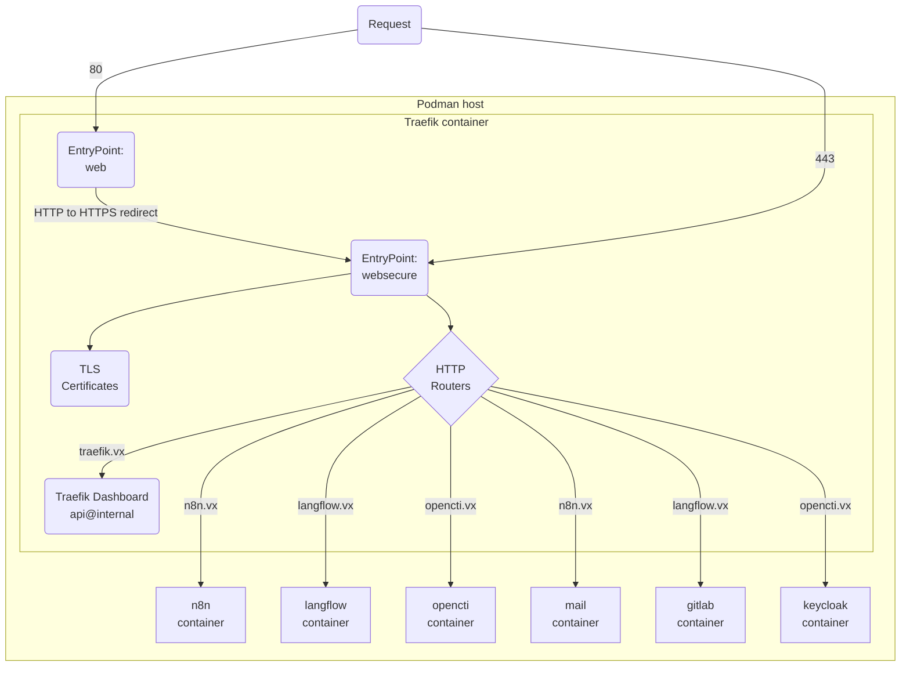
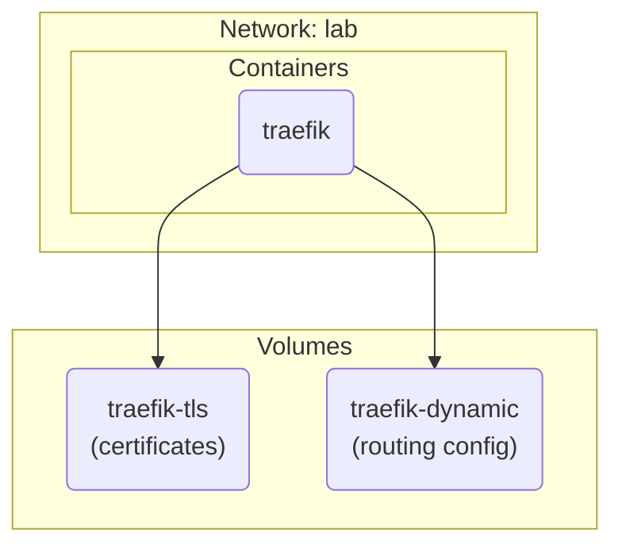

## 1. Components

### 1.1. Lab routing



### 1.2. Quadlets



## 2. Setup

Download the quadlet unit files and reload systemd:

```sh
curl -sL --output-dir /etc/containers/systemd/ -O https://github.com/joetanx/setup/raw/refs/heads/main/podman/quadlets/lab.network
for item in traefik-dynamic.volume traefik-tls.volume traefik.container; do
  curl -sL --output-dir /etc/containers/systemd/ -O https://github.com/joetanx/setup/raw/refs/heads/main/traefik/quadlets/$item
done
systemctl daemon-reload
```

"Start" the Traefik volumes to stage the directories, download the certificates from [lab-certs](https://github.com/joetanx/lab-certs/) and create the Traefik routing (dynamic) configuration:

> [!Tip]
>
> Starting Traefik service automatically starts the Traefik volume because it's listed in the container unit file's `requires`
>
> However, the volumes need to be started manually the first time so that podman volume directories exist for setting up the certificate and configuration files

```sh
systemctl start traefik-tls-volume traefik-dynamic-volume
curl -sL --output-dir /var/lib/containers/storage/volumes/traefik-tls/_data \
-O https://github.com/joetanx/lab-certs/raw/refs/heads/main/soc/soc.pem \
-O https://github.com/joetanx/lab-certs/raw/refs/heads/main/soc/soc.key
cat << EOF > /var/lib/containers/storage/volumes/traefik-dynamic/_data/tls.yml
tls:
  certificates:
    - certFile: /etc/traefik/tls/soc.pem
      keyFile: /etc/traefik/tls/soc.key
EOF
```

Pull container image (optional) and start service:

> [!Tip]
>
> Starting Traefik service automatically starts `lab` network because it's listed in the unit file's `requires`

```sh
podman pull docker.io/library/traefik:latest
systemctl start traefik
```
